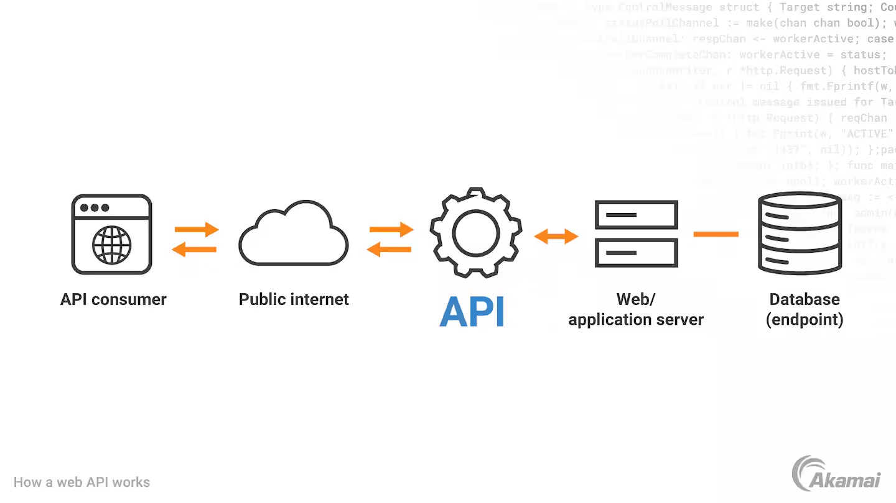

# 0x15. API


An Application Programming Interface (API) is a set of rules and protocols for building and interacting with software applications. APIs define the methods and data formats that applications can use to communicate with each other. They allow developers to access certain features or data of an application, service, or platform without needing to understand its internal implementation.

APIs play a crucial role in enabling software components to interact and share information seamlessly. They are widely used in web development, where they allow different services to interact over the internet. For example, a weather application might use an API to fetch the latest weather data from a remote server, or a social media platform might provide an API for third-party developers to access user data and post content.

By providing a standardized way for applications to communicate, APIs help developers create more modular and scalable software, integrate third-party services, and improve overall functionality and user experience.

## Resources:
- [What is an API ?](https://www.webopedia.com/definitions/api/)
- [What is a REST API](https://www.sitepoint.com/rest-api/)

## Tasks
#### 0. Gather data from an API
Write a Python script that, using this [REST API](https://jsonplaceholder.typicode.com), for a given employee ID, returns information about his/her TODO list progress.

Requirements:

- You must use `urllib` or `requests` module
- The script must accept an integer as a parameter, which is the employee ID
- The script must display on the standard output the employee TODO list progress in this exact format:
    - First line: `Employee EMPLOYEE_NAME is done with tasks(NUMBER_OF_DONE_TASKS/TOTAL_NUMBER_OF_TASKS):`
        - `EMPLOYEE_NAME`: name of the employee
        - `NUMBER_OF_DONE_TASKS`: number of completed tasks
        - `TOTAL_NUMBER_OF_TASKS`: total number of tasks, which is the sum of completed and non-completed tasks
    - Second and N next lines display the title of completed tasks: `TASK_TITLE` (with 1 tabulation and 1 space before the `TASK_TITLE`)

Example:
```shell
sylvain@ubuntu$ python3 0-gather_data_from_an_API.py 2
Employee Ervin Howell is done with tasks(8/20):
     distinctio vitae autem nihil ut molestias quo
     voluptas quo tenetur perspiciatis explicabo natus
     aliquam aut quasi
     veritatis pariatur delectus
     nemo perspiciatis repellat ut dolor libero commodi blanditiis omnis
     repellendus veritatis molestias dicta incidunt
     excepturi deleniti adipisci voluptatem et neque optio illum ad
     totam atque quo nesciunt
sylvain@ubuntu$ python3 0-gather_data_from_an_API.py 4
Employee Patricia Lebsack is done with tasks(6/20):
     odit optio omnis qui sunt
     doloremque aut dolores quidem fuga qui nulla
     sint amet quia totam corporis qui exercitationem commodi
     sequi dolorem sed
     eum ipsa maxime ut
     tempore molestias dolores rerum sequi voluptates ipsum consequatur
sylvain@ubuntu$
sylvain@ubuntu$ python3 0-gather_data_from_an_API.py 4 | tr " " "S" | tr "\t" "T" 
EmployeeSPatriciaSLebsackSisSdoneSwithStasks(6/20):
TSoditSoptioSomnisSquiSsunt
TSdoloremqueSautSdoloresSquidemSfugaSquiSnulla
TSsintSametSquiaStotamScorporisSquiSexercitationemScommodi
TSsequiSdoloremSsed
TSeumSipsaSmaximeSut
TStemporeSmolestiasSdoloresSrerumSsequiSvoluptatesSipsumSconsequatur
sylvain@ubuntu$
```
##### Repo:

- GitHub repository: `alx-system_engineering-devops`
- Directory: `0x15-api`
- File: `0-gather_data_from_an_API.py`

